<table>
  <tr>
    <td width="220" align="center">
      <picture>
        <source media="(prefers-color-scheme: dark)" srcset="assets/logo-dark.png">
        <source media="(prefers-color-scheme: light)" srcset="assets/logo-light.png">
        
      </picture>
    </td>
    <td>
      <h1>Technologies for Advanced Programming</h1>


    </td>
  </tr>
</table>


## Timetable

```mermaid
gantt
    dateFormat  HH:mm
    axisFormat %H:%M
    section Monday
    - No lessons -    :done, 08:00, 0m

    section Tuesday
    - No lessons -    :done, 08:00, 0m

    section Wednesday
    - No lessons -    :done, 08:00, 0m
    section Thursday
    Aula 22 (Chiarenza)  :active,  14:00, 3h

    section Friday
    Aula 24              :active,  08:00, 3h
```


## Getting started
To download the course material, you can either **clone the repository** or **download the ZIP** file from the course page.
```bash
git clone https://github.com/tapunict/tap2026.git
```

## Notebook
All the Jupyter notebooks used in the lectures are stored in the `/doc` folder as `.ipynb` files.
To view them interactively, you’ll need to install [Quarto](https://quarto.org/docs/get-started/) and run:

```bash
quarto preview doc/filename.ipynb
```
This will produce an output similar to:
```text
Browse at http://localhost:7887/
Listening on http://127.0.0.1:7887/
```
Your default browser will automatically open an interactive preview of the notebook.

You can also specify a custom port using the `--port <port_number>` option.

## Exporting Slides
Alternatively, you can render each notebook as an HTML slide deck by running:
```bash
quarto render doc/filename.ipynb
```
The generated HTML files can then be opened in any modern web browser.

## Additional Notes
- Make sure you have Quarto and Jupyter properly installed before running any of the above commands.
- For more details and troubleshooting, refer to the official [Quarto documentation](https://quarto.org/docs/get-started/).
